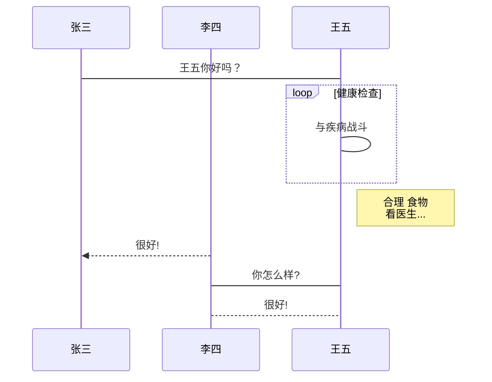
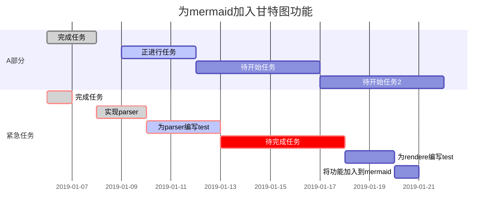
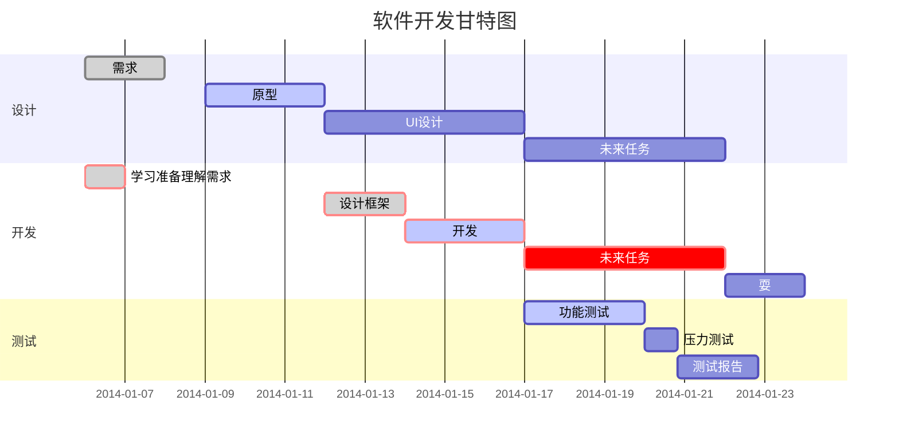

<h6 id="top">TOP</h6>

## 标题
* 使用多个`#`号进行标题级别的表示，例如：
    ># 一级标题
    >###### 六级标题(最大)
* 分别使用`===`和`---`在标题下一行作为一级标题和二级标题。
    >二级标题
    >---

## 分割线
使用三个或三个以上的`*`或`-`构成分割线，可使用空格隔开`-`避免成为二级标题。
- - -

## 粗体和斜体
使用`*`或`_`表示斜体
使和`**`或`__`表示粗体
*斜体*
_斜体_
**粗体**
__粗体__
 ***加粗斜体***
 ___加粗斜体___
~~删除线~~使用两个`~`表示
<u>下划线</u>

## 脚注
脚注自带跳回
```
[^要注明的文本]
[^要注明的文本]:详细解释
可自动生成脚注说明。
```

百度[^搜索引擎]
[^搜索引擎]: 一个搜索引擎。


## 超链接和图片
语法如下
```
网址：
[链接名称](链接地址)
<链接地址>
[链接名称][链接编号]
放在右上角的链接^[链接编号]
[链接编号] ==>直接显示为可点击的链接编号
空行
[链接编号]: 链接地址


图片：


<\a>
html格式可用于更改图片尺寸
```

其中alt为对象,属性文本为加载失败的文字,图片地址为连接
图片链接可使用类似于网址的方括号代替

[第一种写法](https://www.baidu.com/)
[第二种写法][1]:此方法对应的网址另起一行

显示可点击链接 <https://www.baidu.com/>

[1]: https://www.baidu.com/

## 无序列表
使用`-`,`+`,`*`表示无序列表，可反复嵌套
- 一
  -  二
     - 三
       - 四

## 有序列表
使用`数字.`作为表示有序列表，可嵌套
1. 一
   1. 二
      1. 三

## 文字引用
引用降级需在后面加一行`>`
> 第一层次引用
>> 第二层次引用
>
>第一层次引用

## 行内代码块
使用 \` 表示，`行内代码块`，转义使用`\`字符

## 代码块
使用单引号或四个空格作为代码块,前一行应空出:

    #include <stdio.h>
    int main(){
        printf("hello world!")
    }
使用```作为代码块标识,可指定语言:
```Cpp
#include <stdio.h>
int main(){
    printf("hello world!")
}
```
```python
for i in range(10):
    print(i)
```
---
## 表格
第二行表示每一列的对其方式，如：
|编号|数量|价格|
|:----|:----:|---:|
|1|50|￥50|
|2|100|￥20|
其中:`:-`左对齐、`-:`右对齐、`:-:`居中，`-`个数不限。

## 流程图
主要的语法为 `name=>type: describe`,其中 type 主要有以下几种：
1.开始和结束：`start` `end`
2.输入输出：`inputoutput`
3.操作：`operation`
4.条件：`condition`
5.子程序：`subroutine`
第一步：创建节点
第二部：编写节点连接图
第三部：放入表示符` ```flow` 和` ``` `之间
其中连接流程图时可采用`name(top/bottom/left/right)`使其按照要求方向连线。

```flow
 ST=>start: ST A=0:>https://www.baidu.com/
 io=>inputoutput: IO N=?
 op=>operation: OP A+N
 can=>condition: Choice A>100
 SUB=>subroutine: NEXT 2*A
 E=>end: END

 ST->io->op->can
 can(yes)->E
 can(no)->SUB->io
```
竖/横向流程图源码格式

    ```mermaid
    graph TD/LR
    ```
标准流程图

    ```flow
    ```
UML时序图

```sequence
Title: 标题：复杂使用
对象A->对象B: 对象B你好吗?（请求）
Note right of 对象B: 对象B的描述
Note left of 对象A: 对象A的描述(提示)
对象B-->对象A: 我很好(响应)
对象B->小三: 你好吗
小三-->>对象A: 对象B找我了
对象A->对象B: 你真的好吗？
Note over 小三,对象B: 我们是朋友
participant C
Note right of C: 没人陪我玩
```

UML标准时序图

甘特图


## 数学公式
前后标识符使用`$`表示，一个代表在行内，两个代表独占一行。
如质量守恒公式：$E=mc^2$ $$E=mc^2$$
支持**LaTex**,编辑显示支持。前后标识符为使用`\`输入
$\sum_{i=1}^n a_i = ?$
$a\div b$

## 支持HTML标签
空白&nbsp;不断行的空白&ensp;半方大的空白&emsp;全方大的空白
空白&#160;不断行的空白&#8194;半方大的空白&#8195;全方大的空白
<kbd>Ctrl</kbd>键盘按键风格


## 页面内跳转
[无序列表](#无序列表)
[流程图](#流程图)
[top](#top)
可以跳转到标题，可以跳转到html对应标签id位置


